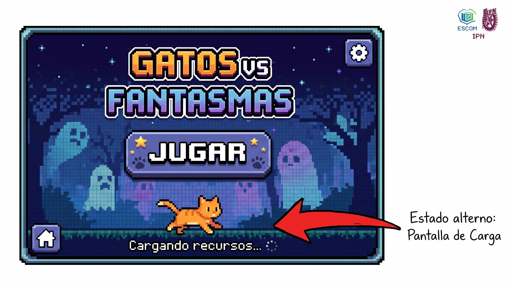
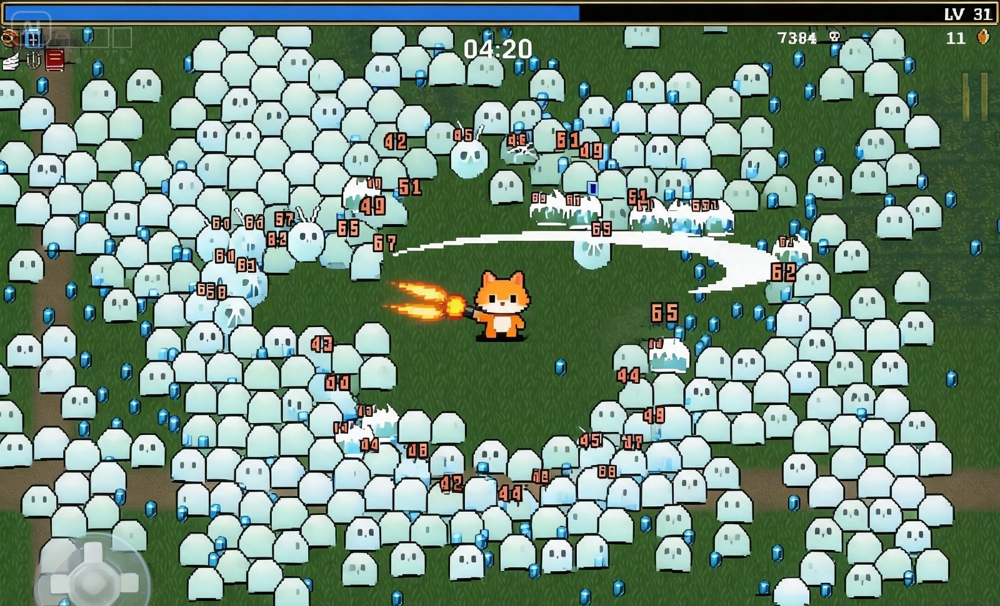
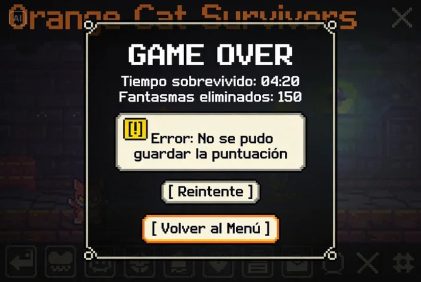

# Ficha de Idea: GATOSVSFANTASMAS

**Problema observable:**
Los juegos de acción en dispositivos móviles suelen exigir demasiada atención visual y controles táctiles complejos, lo que dificulta el juego durante sesiones cortas o en movimiento.

**Ruta elegida y motivo:**
Idea propia desarrollada desde cero.El motivo es crear un exponente original del subgénero *Bullet Heaven* optimizado específicamente para los controles y tiempos de sesión de la plataforma móvil.

**Usuario y contexto:**
Jovenes que utilizan su teléfono móvil en trayectos de transporte público o durante tiempos muertos, buscando entretenimiento rápido que no exija toda su atención táctil al permitir jugar con una sola mano.

**Alternativa actual:**
Juegos de supervivencia de hordas que demandan sesiones largas consola/PC, o *shooters* convencionales en móvil con joysticks duales que requieren obligatoriamente el uso de ambas manos.

**Tarea principal:**
Sobrevivir a oleadas continuas de enemigos moviendo al gato por la arena para esquivar, mientras el personaje ataca de forma completamente automática.

**Criterio de éxito:**
El usuario comprende el sistema de movimiento y auto-disparo en los primeros 30 segundos, logrando subir de nivel al menos una vez en su primera partida.

**Alcance de la primera versión:**
Un mapa básico, un personaje jugable (gato), un arma de proyectil o cuerpo a cuerpo automático y dos variantes de enemigos (fantasmas base y fantasmas rápidos).

**Funciones aplazadas:**
Progresión metapartida (árbol de habilidades global), cosméticos, multijugador, selección de diferentes personajes y jefes de escenario.

**Hipótesis pendiente de validar:**
Declaramos de forma explícita que el interés del público en jugar "GATOSVSFANTASMAS", una temática visual ligera y accesible retendrá mejor a la audiencia casual móvil que la estética de fantasía oscura habitual en este género y su viabilidad comercial son todavía una hipótesis sin validar, ya que aún no hemos realizado pruebas ni encuestas con usuarios.
## 1.2 Material visual de la idea

### Diagrama del recorrido del usuario
graph TD
    A[Abre la aplicación] --> B{¿Carga exitosa?}
    B -- No --> C[Estado: Pantalla de Error de Carga]
    C --> A
    B -- Sí --> D[Menú Principal]
    D --> E[Inicia Partida / Carga Escenario]
    E --> F[Pantalla de Juego]
    F --> G{¿Sube de Nivel?}
    G -- Sí --> H[Estado: Selección de Mejora]
    H --> F
    G -- No --> I{¿Pierde toda la salud?}
    I -- No --> F
    I -- Sí --> J[Pantalla de Fin de Partida / Game Over]
    J --> K{¿Guardar Récord?}
    K -- Fallo de red --> L[Estado: Error al guardar datos]
    L --> D
    K -- Éxito --> D

### Bosquejos de las pantallas principales

A continuación se presentan los esquemas de las pantallas principales del juego, incluyendo los estados que no son la ruta feliz (carga y error) y los controles de juego.

#### Pantalla A: Menú Principal (con estado de carga)

Bosquejo del Menú Principal indicando el estado alterno de carga. Elaborado por Diego Mendieta. Generado con asistencia de IA.

#### Pantalla B: Pantalla de Juego

Esquema de la pantalla de juego mostrando sus elementos y controles. Elaborado por Sofia Ortega. Generado con asistencia de IA.

#### Pantalla de Fin de Partida (con estado de error)

Bosquejo de Fin de Partida indicando el estado alterno de error al guardar datos. Elaborado por Sofia Ortega. Generado con asistencia de IA.

## 1.3 Historia de usuario y criterio de aceptación

### Historia de usuario

**Como jugador móvil que busca entretenimiento rápido durante tiempos muertos, quiero mover al gato por la arena mientras su ataque se ejecuta automáticamente para sobrevivir a las oleadas de fantasmas sin tener que utilizar controles táctiles complejos.**

### Criterio de aceptación

**Dado** que el jugador se encuentra en la pantalla de juego al iniciar una partida, **cuando** utilice el joystick virtual para mover al gato y permanezca dentro de la arena durante la partida, **entonces** el gato deberá desplazarse en la dirección indicada mientras realiza ataques automáticamente contra los enemigos cercanos, sin que el jugador tenga que pulsar un botón adicional para atacar.

### Verificación

El criterio de aceptación es verificable mediante una prueba directa:

1. Iniciar una partida desde el menú principal.
2. Comprobar que aparece el gato dentro de la arena junto con los enemigos.
3. Mover el joystick virtual en cualquier dirección.
4. Verificar que el gato se desplaza en la dirección indicada.
5. No pulsar ningún botón de ataque.
6. Verificar que el gato realiza ataques automáticamente contra los enemigos.
7. Confirmar que el comportamiento se mantiene mientras el jugador continúa moviéndose.

**Resultado esperado:** Sí / No. El jugador puede controlar el movimiento del gato mediante un único joystick y el ataque se ejecuta automáticamente sin requerir un botón de ataque.
